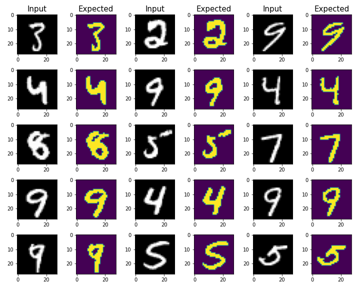

# 🧠 UNet 2D com MONAI & PyTorch Lightning

**Segmentação semiautomática de dígitos MNIST usando arquitetura UNet 2D com MONAI, PyTorch e PyTorch Lightning**

---

## 📚 Bibliotecas Utilizadas

- [MONAI](https://monai.io/) – módulo `monai.networks.nets.UNet` para construir a UNet 2D :contentReference[oaicite:1]{index=1}  
- [PYTORCH](https://pytorch.org) – backend de deep learning  
- [PYTORCH LIGHTNING](https://lightning.ai/docs/pytorch/stable/) – estrutura para organizar treinamento com menos boilerplate  
- [TORCHVISION MNIST](https://docs.pytorch.org/vision/stable/generated/torchvision.datasets.MNIST.html?highlight=mnist) – para carregar o dataset MNIST :contentReference[oaicite:2]{index=2}  
- Python (numpy, os, datetime…)

---

## 🧩 Conjunto de Dados

- **Dataset**: MNIST  
  - Imagens de dígitos manuscritos (28×28), rotuladas de 0 a 9  
  - Foi utilizado como proxy para simular segmentação: cada dígito vira uma **máscara binária**  
  - Pré-processamento realizado em `process_data.py`

---

## 🧪 Exemplos do Dataset



Amostras do conjunto de dados MNIST utilizado para simular segmentação binária.


## 🏗️ Arquitetura da Rede

O modelo UNet 2D foi definido com:

- `spatial_dims=2`, `in_channels=1`, `out_channels=1`
- **Camadas**: `(14, 28, 56)` filtros progressivamente em encoder/decoder
- **Strides**: `(2, 2, 2)` — dois down/up-samples de fator 2
- `num_res_units=0` (sem residuais), ativação `PReLU`, normalização `InstanceNorm`
- Usando `UNet` do MONAI

A definição segue este bloco:

```python
net = UNet(
  spatial_dims=2, in_channels=1, out_channels=1,
  channels=(14, 28, 56), strides=(2, 2, 2), num_res_units=2, kernel_size=3, dropout=.2)
